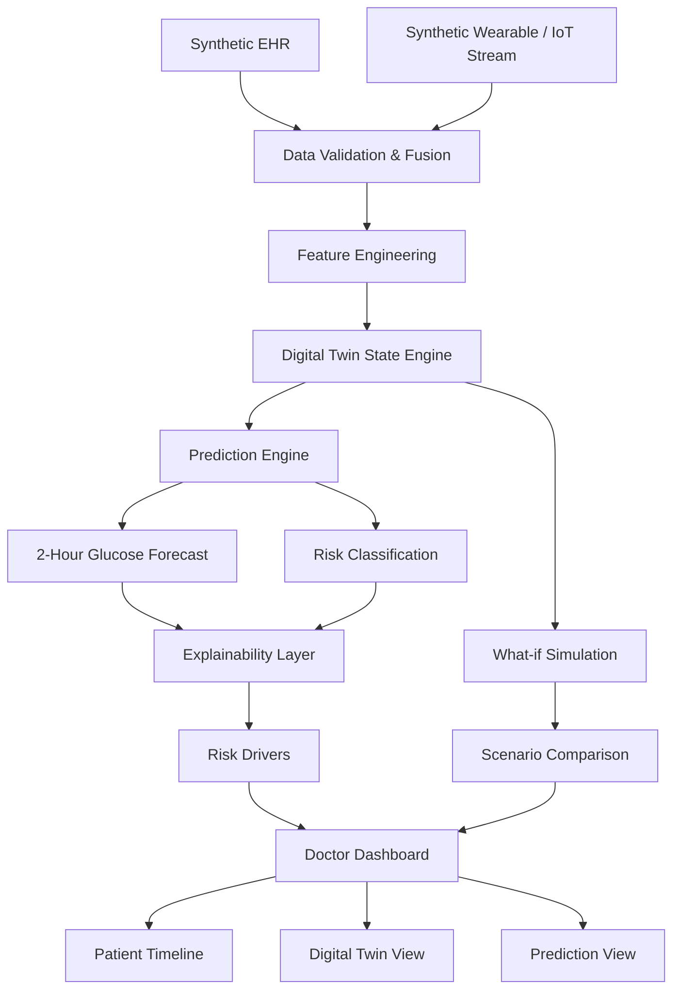

# GlycoTwin AI

### Explainable Digital Twin for Proactive Glucose Spike Risk Forecasting

> **GlycoTwin AI** is a research prototype that demonstrates how a healthcare Digital Twin can combine longitudinal Electronic Health Record (EHR) data with continuously updated wearable/IoT signals to forecast short-term glucose spike risk in synthetic Type 2 Diabetes patients.

[](https://www.python.org/)
[](https://react.dev/)
[](https://fastapi.tiangolo.com/)
[](https://www.typescriptlang.org/)
[](https://www.docker.com/)

---

## 1. Executive Summary

Healthcare data is often fragmented across clinical records, laboratory measurements, and continuously generated wearable signals.

GlycoTwin AI explores a different approach:

```text
                  STATIC HEALTH RECORD
                         │
                         │
                         ▼
                  ┌──────────────┐
                  │  DATA FUSION │
                  └──────┬───────┘
                         │
       ┌─────────────────┴─────────────────┐
       │                                   │
       ▼                                   ▼
 EHR / Clinical Data               Wearable / IoT Stream
       │                                   │
       └─────────────────┬─────────────────┘
                         ▼
                 ┌──────────────┐
                 │ DIGITAL TWIN │
                 └──────┬───────┘
                        │
                        ▼
                 ┌──────────────┐
                 │ AI FORECAST  │
                 └──────┬───────┘
                        │
             ┌──────────┴──────────┐
             ▼                     ▼
       Explainable Risk       What-if Simulation
             │                     │
             └──────────┬──────────┘
                        ▼
                DOCTOR DASHBOARD
```

The prototype maintains a continuously updated virtual patient state and estimates the probability and magnitude of a near-term glucose spike approximately **two hours ahead**.

The system is designed around five core capabilities:

1. **Static + dynamic data fusion**
2. **Digital Twin state representation**
3. **Short-term glucose forecasting**
4. **Explainable risk analysis**
5. **What-if scenario simulation**

---

# 2. Challenge Alignment

GlycoTwin AI directly addresses the Digital Twin Challenge requirement to demonstrate the fusion of:

### Static / Historical Data

* Demographics
* BMI
* HbA1c
* Fasting glucose
* Cholesterol
* Blood pressure
* Diabetes duration
* Family history
* Medication history
* Historical glucose measurements

### Dynamic / Real-Time Data

* Continuous glucose
* Heart rate
* Heart-rate variability (HRV)
* Steps
* Sleep duration
* Sleep quality
* Activity level
* Calories
* Meal carbohydrate metadata

### Model Output

The fused state is used to estimate:

* Future glucose level
* Glucose spike probability
* Risk score
* Risk category
* Prediction confidence
* Contributing factors

### Clinician-Facing Interface

The dashboard provides a conceptual interface for reviewing:

* Patient state
* Current physiological signals
* Digital Twin state
* Forecast trajectory
* Risk factors
* Historical timeline
* What-if scenarios

---

# 3. Problem Statement

Type 2 Diabetes management involves information generated from multiple sources over different time scales.

Clinical records provide relatively stable patient characteristics and historical context, while wearable and IoT devices provide continuously changing physiological and behavioral signals.

A model that considers only one of these sources can miss important context.

GlycoTwin AI therefore explores a Digital Twin architecture in which:

```text
Historical Patient Context
          +
Current Physiological State
          +
Recent Behavioral Signals
          ↓
      Digital Twin
          ↓
Short-Term Forecast
```

The specific prototype use case is:

> **Forecasting elevated glucose risk approximately two hours ahead using fused synthetic EHR and wearable time-series data.**

---

# 4. Why a Digital Twin?

A conventional prediction model produces an output.

A Digital Twin maintains a **state**.

GlycoTwin AI represents the patient through multiple synchronized dimensions:

```text
                 DIGITAL TWIN
                      │
       ┌──────────────┼──────────────┐
       │              │              │
       ▼              ▼              ▼
   Metabolic      Activity        Sleep
      State          State          State
       │              │              │
       └──────────────┼──────────────┘
                      │
                      ▼
              Cardiovascular
                   State
                      │
                      ▼
                 Risk State
                      │
                      ▼
               AI Forecast
```

This allows the system to represent the relationship between:

* long-term patient characteristics
* recent physiological signals
* behavioral patterns
* predicted future state

---

# 5. Core Innovation

The prototype is centered around a closed Digital Twin loop:

```text
OBSERVE
   ↓
Fuse EHR + Wearable Data
   ↓
UPDATE
   ↓
Digital Twin State
   ↓
PREDICT
   ↓
Future Glucose / Risk
   ↓
EXPLAIN
   ↓
Identify Contributing Signals
   ↓
SIMULATE
   ↓
Explore Alternative Patient States
   ↓
UPDATE
```

The objective is not simply to display health data.

The objective is to demonstrate how multiple data streams can continuously update a virtual patient representation and produce an interpretable forecast.

---

# 6. System Architecture



---

# 7. Data Architecture

## 7.1 Static EHR Layer

The synthetic EHR contains patient-level information that changes relatively slowly.

Example:

```text
Patient ID          PT-001
Age                 48
Sex                 Female
BMI                 27.4
HbA1c               7.2
Fasting Glucose     128
Diabetes Duration   5 years
Systolic BP         136
Diastolic BP        84
Cholesterol         198
```

These variables provide the Digital Twin with longitudinal patient context.

---

## 7.2 Dynamic Wearable Layer

The simulated wearable stream provides hourly measurements:

```text
Timestamp
Glucose
Heart Rate
HRV
Steps
Sleep
Sleep Quality
Activity
Calories
Meal Carbohydrates
```

The generator produces 30 days of hourly observations for each synthetic patient.

---

# 8. Synthetic Data Strategy

The prototype intentionally uses synthetic data.

This allows the project to demonstrate the complete architecture without exposing real patient information.

The generator creates:

* 100 synthetic patients
* 30 days of hourly observations
* Clinical attributes
* Laboratory attributes
* Wearable signals
* Behavioral variables

The generation process uses seeded randomness for reproducibility.

The synthetic data generator models relationships between variables such as:

```text
Higher meal carbohydrate load
            ↓
Potentially higher future glucose

Reduced activity
            ↓
Potentially higher glucose variability

Reduced sleep
            ↓
Potentially higher metabolic risk

Higher HbA1c / BMI
            ↓
Higher baseline risk
```

These relationships are intended to create a realistic demonstration environment rather than represent clinically validated causal relationships.

---

# 9. Feature Engineering

The feature pipeline combines static and temporal information.

## Static Features

* Age
* BMI
* HbA1c
* Fasting glucose
* Cholesterol
* Blood pressure
* Diabetes duration

## Dynamic Features

* Current glucose
* Heart rate
* HRV
* Steps
* Sleep duration
* Sleep quality
* Activity level
* Meal carbohydrate load

## Temporal Features

* Hour
* Day of week
* Night indicator
* Meal-window indicator

## Lag Features

```text
glucose_lag_1
glucose_lag_2
glucose_lag_3
glucose_lag_6
glucose_lag_12
```

## Rolling Features

```text
glucose_mean_3h
glucose_mean_6h
glucose_mean_12h
glucose_std_6h
hr_mean_3h
steps_sum_6h
```

The purpose is to allow the model to understand both the current state and recent trajectory.

---

# 10. Machine Learning Pipeline

GlycoTwin AI uses two complementary prediction tasks.

## Model 1: Glucose Forecasting

A regression model estimates glucose approximately two hours into the future.

```text
Fused Patient Features
          ↓
Feature Engineering
          ↓
Regression Model
          ↓
Predicted Glucose
```

Tracked metrics:

* MAE
* RMSE
* R²

---

## Model 2: Risk Classification

A classification model estimates whether the future glucose trajectory crosses the configured spike threshold.

Tracked metrics:

* Accuracy
* Precision
* Recall
* F1
* ROC-AUC

The model is evaluated using patient-level splitting to reduce leakage between training and evaluation populations.

These metrics are research/demo metrics and should not be interpreted as clinical validation.

---

# 11. Digital Twin Engine

The Digital Twin engine combines:

```text
Patient Profile
      +
Historical Data
      +
Recent Wearable Stream
      +
Feature State
      +
Model Forecast
```

and produces a unified state representation.

Example:

```json
{
  "patient_id": "PT-001",
  "physiological_state": {
    "glucose": 126,
    "heart_rate": 82,
    "hrv": 41,
    "sleep": 5.8,
    "activity": 4200
  },
  "metabolic_state": {
    "hba1c": 7.2,
    "bmi": 27.4
  },
  "risk_state": {
    "score": 82,
    "level": "HIGH"
  },
  "prediction": {
    "glucose_2h": 189
  }
}
```

The Digital Twin is refreshed whenever new dynamic data is incorporated.

---

# 12. Explainable AI

A major design goal is to avoid presenting a prediction as an unexplained number.

The system therefore exposes model contributing factors.

Example:

```text
CONTRIBUTING FACTORS

Meal carbohydrate load       ↑
Recent sleep reduction       ↑
Low recent activity          ↑
Current glucose level        ↑
Recent activity              ↓
```

Where available, SHAP is used for model explanation.

If SHAP artifacts are unavailable, the application uses an interpretable fallback calculation rather than displaying fabricated explanation values.

---

# 13. What-if Simulation

One of the central demonstration features is scenario simulation.

The user can modify:

```text
Meal carbohydrate intake
Additional activity
Sleep duration
```

The system compares:

```text
CURRENT STATE
      VS
SIMULATED STATE
```

Example:

```text
                    BASELINE       SCENARIO

Predicted glucose      189             163
Risk score               82              61

Difference:
Glucose                  -26
Risk score               -21
```

The output is a **model-generated scenario comparison**, not a treatment recommendation.

This feature demonstrates how a Digital Twin can be used to explore changes in the simulated patient state.

---

# 14. Doctor Dashboard

The primary interface is designed as a clinician-oriented command center.

## Overview

The dashboard presents:

* Patient identity
* Current physiological state
* Risk score
* Prediction horizon
* Predicted glucose
* Confidence
* Glucose trajectory
* Digital Twin state
* AI explanation
* Alerts
* Patient timeline

---

## Dashboard Information Hierarchy

```text
PATIENT
   ↓
CURRENT STATE
   ↓
RISK
   ↓
FORECAST
   ↓
WHY
   ↓
WHAT-IF
```

This keeps the most important information visible without requiring the user to navigate through multiple screens.

---

# 15. Application Modules

## Overview

Central command center showing the current Digital Twin state.

## Patients

Patient profile, EHR context, laboratory history, and wearable timeline.

## Digital Twin

Virtual representation of the patient's metabolic, activity, sleep, and cardiovascular state.

## Predictions

Forecasts, risk scores, prediction confidence, historical predictions, and model metrics.

## What-if Simulation

Interactive scenario modeling using patient-state variables.

---

# 16. API Architecture

### Health

```http
GET /api/health
```

### Patients

```http
GET /api/patients
GET /api/patients/{patient_id}
GET /api/patients/{patient_id}/timeline
```

### Digital Twin

```http
GET /api/patients/{patient_id}/twin
```

### Prediction

```http
GET /api/patients/{patient_id}/prediction
```

### Explainability

```http
GET /api/patients/{patient_id}/explanation
```

### Simulation

```http
POST /api/simulation
```

### Dashboard

```http
GET /api/dashboard/summary
```

Interactive API documentation is available through FastAPI's generated API interface during local development.

---

# 17. Example Prediction Response

```json
{
  "patient_id": "PT-001",
  "prediction_horizon_minutes": 120,
  "current_glucose": 126,
  "predicted_glucose_2h": 189,
  "glucose_delta": 63,
  "risk_score": 82,
  "risk_level": "HIGH",
  "confidence": 0.87,
  "target_event": "GLUCOSE_SPIKE",
  "model_version": "glycotwin-v1"
}
```

All prediction values are generated from synthetic data and the prototype's research models.

---

# 18. Technology Stack

### Frontend

* React 19
* TypeScript
* Vite
* Tailwind CSS
* Recharts
* Framer Motion
* Lucide React
* Axios

### Backend

* Python 3.11+
* FastAPI
* Pydantic
* Pandas
* NumPy
* Scikit-learn
* XGBoost
* LightGBM
* SHAP
* Joblib

### Engineering

* Docker
* Docker Compose
* GitHub Actions
* Pytest

---

# 19. Repository Structure

```text
GlycoTwin-AI/
│
├── backend/
│   ├── app/
│   │   ├── api/
│   │   ├── core/
│   │   ├── models/
│   │   ├── services/
│   │   └── utils/
│   │
│   ├── data/
│   │   ├── raw/
│   │   ├── processed/
│   │   └── generate_data.py
│   │
│   ├── models/
│   ├── notebooks/
│   └── requirements.txt
│
├── frontend/
│   ├── src/
│   │   ├── components/
│   │   ├── hooks/
│   │   ├── pages/
│   │   ├── services/
│   │   └── types/
│   │
│   ├── public/
│   └── package.json
│
├── docs/
│   ├── architecture.pdf
│   ├── presentation.pdf
│   └── demo-script.md
│
├── .github/
│   └── workflows/
│
├── docker-compose.yml
├── LICENSE
├── .gitignore
└── README.md
```

---

# 20. Local Development

## Prerequisites

* Python 3.11+
* Node.js 20+
* npm
* Git

---

## Backend

```bash
cd backend

python -m venv .venv
```

### Windows

```powershell
.venv\Scripts\activate
```

### macOS / Linux

```bash
source .venv/bin/activate
```

Install dependencies:

```bash
pip install -r requirements.txt
```

Generate synthetic data:

```bash
python data/generate_data.py
```

Start the API:

```bash
uvicorn app.main:app --reload
```

Backend:

```text
http://127.0.0.1:8000
```

API documentation:

```text
http://127.0.0.1:8000/docs
```

---

# 21. Frontend

Open a second terminal:

```bash
cd frontend
npm install
npm run dev
```

The Vite development server will provide the local application URL.

---

# 22. Docker

Run the complete stack:

```bash
docker compose up --build
```

This starts:

```text
Frontend
    │
    ▼
FastAPI Backend
    │
    ▼
Digital Twin + ML Services
    │
    ▼
Synthetic Patient Data
```

---

# 23. Demo Scenario

The default demonstration patient is:

```text
Patient ID: PT-001
```

The demonstration follows a complete Digital Twin lifecycle.

### Step 1: Patient context

The system loads the synthetic EHR.

### Step 2: Wearable stream

Recent physiological and behavioral data is incorporated.

### Step 3: Data fusion

Static and dynamic signals are combined.

### Step 4: Digital Twin update

The patient's virtual state is refreshed.

### Step 5: Forecast

The model estimates the future glucose trajectory.

### Step 6: Explainability

The dashboard identifies the strongest contributing signals.

### Step 7: Scenario simulation

The user modifies simulated variables and compares the resulting forecast.

---

# 24. Example Demo Flow

```text
Synthetic EHR
     ↓
Wearable Stream
     ↓
Data Fusion
     ↓
Digital Twin
     ↓
Glucose Forecast
     ↓
Risk Explanation
     ↓
What-if Simulation
     ↓
Scenario Comparison
```

The objective of the demo is to show the complete end-to-end pipeline rather than only the final prediction.

---

# 25. Model Safety & Healthcare Positioning

GlycoTwin AI is a **research and educational prototype**.

It does not:

* diagnose disease
* prescribe medication
* replace a clinician
* provide individualized medical treatment
* claim clinical efficacy
* make autonomous clinical decisions

The risk score and forecast are model-generated outputs based on synthetic data.

> **Not for clinical diagnosis, treatment, or medical decision-making.**

---

# 26. Ethical Considerations

### Privacy

Only synthetic data is used in this prototype.

### Data Governance

No personally identifiable patient information is required.

### Model Transparency

Prediction outputs are accompanied by contributing factors where supported.

### Human Oversight

The system is designed as a decision-support research concept rather than an autonomous medical system.

### Responsible AI

The prototype explicitly distinguishes between:

```text
Prediction
    ≠
Diagnosis
```

and:

```text
Scenario Simulation
    ≠
Treatment Recommendation
```

---

# 27. Limitations

This prototype has important limitations.

1. The dataset is synthetic.
2. Synthetic relationships do not establish clinical validity.
3. The prediction models have not undergone clinical validation.
4. Wearable signals are simulated rather than connected to production medical devices.
5. The Digital Twin represents a focused metabolic use case rather than a whole-body physiological model.
6. The current prototype does not replace clinician assessment.
7. Real-world deployment would require extensive validation, governance, security, interoperability, and regulatory review.

---

# 28. Future Roadmap

### Phase 1 — Prototype

* Synthetic EHR
* Wearable simulation
* Data fusion
* Glucose forecasting
* Explainability
* Digital Twin dashboard

### Phase 2 — Advanced Twin

* Patient-specific calibration
* More granular physiological states
* Multimodal sensor integration
* Longitudinal adaptation
* Model drift monitoring

### Phase 3 — Research Platform

* Real-world de-identified datasets
* Prospective validation
* Clinician feedback
* Interoperability with healthcare data standards
* Robust uncertainty estimation

### Phase 4 — Clinical Research

Subject to appropriate validation, governance, ethics review, and regulatory requirements.

---

# 29. Project Status

```text
Synthetic Data Generation       ✓
EHR + Wearable Fusion           ✓
Feature Engineering             ✓
Digital Twin Engine             ✓
Glucose Forecasting             ✓
Risk Classification             ✓
Explainability                  ✓
What-if Simulation              ✓
Doctor Dashboard                ✓
API Layer                       ✓
Docker Support                  ✓
Automated Testing               ✓
CI Pipeline                     ✓
```

---

# 30. Team

### Team

**Team Name:** `Hacknetic Force`

### Responsibilities

| Area                      | Responsibility                                     |
| ------------------------- | -------------------------------------------------- |
| Digital Twin Architecture | System design and patient-state modeling           |
| AI / ML                   | Feature engineering, forecasting and risk modeling |
| Backend                   | FastAPI services and data pipeline                 |
| Frontend                  | Clinical dashboard and visualization               |
| Explainability            | Model interpretation                               |
| Simulation                | What-if scenario engine                            |
| Documentation             | Architecture, safety and challenge submission      |

---

# 31. Open Source

This project is intended for research, education, and demonstration.

A formal open-source license should be included before public release.

See:

```text
LICENSE
```

---

# 32. Screenshots

Add screenshots of:

1. Command Center
2. Patient Profile
3. Digital Twin
4. Prediction Analysis
5. What-if Simulation

Recommended format:

```text
docs/screenshots/
├── dashboard.png
├── patient.png
├── digital-twin.png
├── predictions.png
└── simulation.png
```

---

# 33. Demo Video

A 2–5 minute demonstration should show:

```text
00:00  Problem
00:20  Patient EHR
00:45  Wearable stream
01:05  Digital Twin
01:30  Prediction
01:55  Explainability
02:20  What-if simulation
02:50  Technical architecture
03:20  Impact and limitations
```

Add the final video link here:

```text
Demo: [Add YouTube / presentation link]
```

---

# 34. Architecture Documentation

The complete architecture diagram should be provided separately in:

```text
docs/architecture.pdf
```

The presentation should be provided in:

```text
docs/presentation.pdf
```

Both files should remain accessible from the public GitHub repository.

---

# 35. Research Positioning

GlycoTwin AI is designed to demonstrate a possible architecture for combining longitudinal patient context with continuously updated physiological signals.

The prototype focuses on one localized health outcome:

> **Short-term glucose spike risk forecasting for synthetic Type 2 Diabetes patients.**

Rather than attempting to build a whole-body Digital Twin, the project intentionally focuses on a narrowly defined prediction task that can be demonstrated end-to-end within a prototype environment.

---

# 36. Citation & References

Add the final references used for:

* Synthetic healthcare data generation
* Digital Twin concepts
* Wearable datasets
* Machine-learning methodology
* Explainable AI methodology
* Healthcare data governance

Recommended repository location:

```text
docs/references.md
```

All external datasets, frameworks, research papers, and third-party assets used by the project should be properly attributed.

---

# 37. Disclaimer

> **GlycoTwin AI is a research, educational, and hackathon prototype built using synthetic data. It is not a medical device and is not intended for diagnosis, treatment, prevention, or clinical decision-making. Model outputs are experimental estimates and must not be interpreted as medical advice.**
