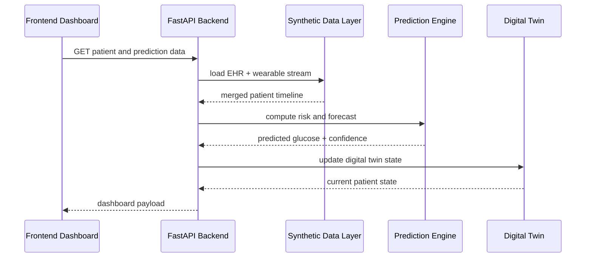

# GlycoTwin AI Architecture

## 1. Data layer

Synthetic generation creates patient metadata, labs, and a long wearable stream. The raw outputs live under `backend/data/raw` and are loaded by the backend using pandas.

## 2. EHR layer

Static patient data includes age, sex, height, weight, BMI, HbA1c, fasting glucose, and historical clinical context. These features set the baseline risk profile used by the digital twin.

## 3. Wearable stream

Hourly time-series features capture glucose, heart rate, HRV, sleep, step count, calories, and meal carbohydrate estimates. These provide the dynamic inputs needed for near-term prediction.

## 4. Data fusion

The backend merges static EHR and dynamic wearable streams into a single patient timeline before feature engineering. The result is a fused representation used for prediction and simulation.

## 5. Feature engineering

Feature engineering creates lag features, rolling means, rolling variability, meal activity features, and temporal signals like hour-of-day and meal windows. These features are reusable for both training and inference.

## 6. Digital Twin

The digital twin keeps a live patient snapshot that consolidates current physiological readings, metabolic state, risk score, and model-based forecast. It provides a concise representation of the current clinical context.

## 7. ML inference

The backend generates a two-hour-ahead glucose estimate and a binary spike flag. Risk is computed with a fallback model if trained artifacts are unavailable, which preserves API usability.

## 8. Explainability

The explanation service ranks features that most strongly affect predicted risk, such as high carbohydrate load, poor sleep, low sleep quality, and reduced activity. This helps communicate model reasoning in a transparent, interpretable way.

## 9. Simulation

The simulation endpoint adjusts patient inputs representing meal changes, step changes, and sleep modifications. It compares baseline and simulated predictions to estimate the effect of interventions on future glucose risk.

## 10. Dashboard

The dashboard displays a high-density clinical summary with patient profiles, risk scorecards, digital twin state, explanation, and simulation outputs. It is designed to match a professional, doctor-facing experience while remaining research-oriented.

